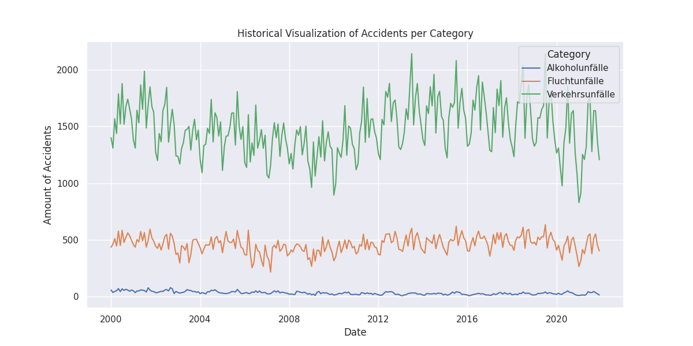
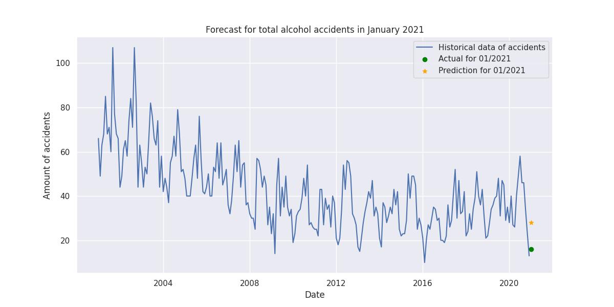

# DPS AI Engineering Challenge

The goal of the challenge is to historically visualize the number of accidents. The application should also forecast the values for:
- Category: 'Alkoholunfälle'
- Type: 'insgesamt'
- Year: '2021'
- Month: '01'

Run `app.py` to execute the script that forecasts the value. It also generates two plots to visualize the accidents by category and also the actual value and the prediction for alcohol accidents.

The following images show the results for:
- Accidents values by category
  
- Model prediction vs. actual value
  
